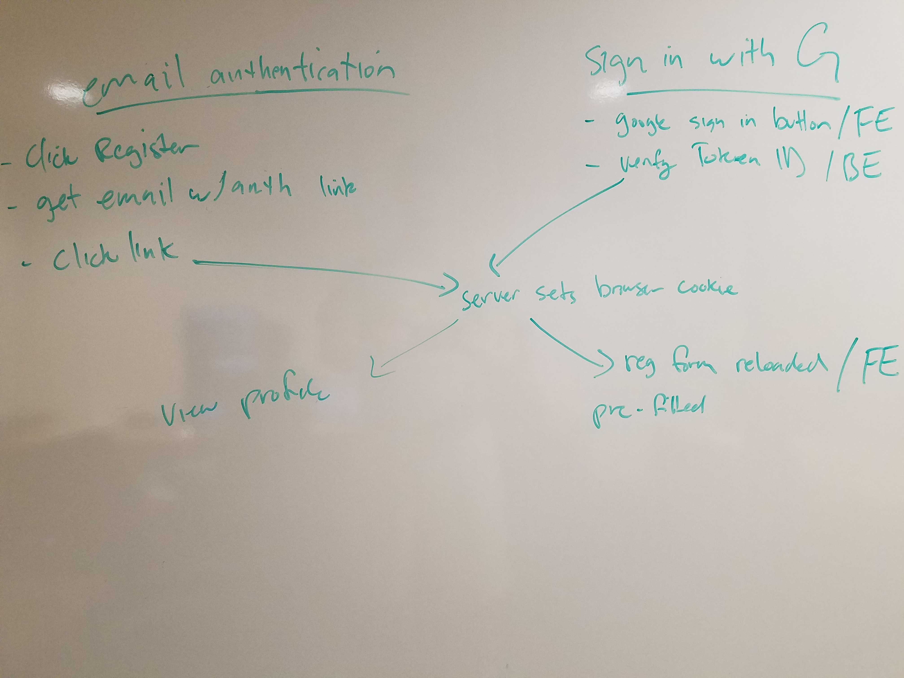

# Hackathon App

Welcome to the hackathon app: a web app using a React frontend and a python flask backend

## Getting setup for local development

### Frontend

Node 12 is required for the frontend. You can use [nvm](https://github.com/creationix/nvm#installation) and [avn](https://github.com/wbyoung/avn#install) to easily switch Node versions between different projects.

From `sdk-examples/python/hackathon_app/` directory:
```sh
cd frontend/
yarn install
yarn start
```

You can work on the frontend React app without running the python server or having any backend google sheets or looker instance dependencies. Simply skip the remaining setup.

### Backend

hackathon_app requires python 3.7+ The easiest way to get this installed on a mac is to install [pyenv](https://github.com/pyenv/pyenv#installation) via [homebrew](https://brew.sh/). If you already have pyenv and pipenv installed then skip to the "Install all dependencies" step

(note, if you were in the `frontend/` directory above then `cd ..` back to `sdk-examples/python/hackathon_app/`)
```sh
brew install pyenv
```

**Important** [Follow these remaining steps (only 3 - 5)](https://github.com/pyenv/pyenv#basic-github-checkout) to complete the pyenv installation

Now you’re ready to install python 3.7 and set it as your global python version for the following steps

```sh
pyenv install 3.7.4
pyenv global 3.7.4
```

hackathon_app uses [pipenv](https://docs.pipenv.org/en/latest/#install-pipenv-today) to manage project dependencies

```sh
brew install pipenv
```

Install all dependencies.

```sh
pipenv install --dev
```

#### Create sheets api creds

Create a GCP project in your personal google console account:

- enable Sheets api
- enable Drive api
- create a service account
- download the .json creds file
- copy the email address for the next step

#### Setup `env.list`

- Copy `env.list.sample` to `env.list` and modify accordingly (see instructions for base64 encoding your gcp .json credentials in the code comment for `GOOGLE_APPLICATION_CREDENTIAL_ENCODED`)
- Leave `GOOGLE_SHEET_ID` alone for now, you'll add it after the next step

#### Create a google spreadsheet

```sh
./create-test-sheet.sh <email-to-own-sheet@same-gmail-domain-as-gcp-project.com>
```

- go back to your spreadsheet and "share" it with the email address of the service account
- Note the sheet ID (from the output) to use in the `env.list` file below.

#### Run local dev servers

```sh
./start-dev-flask.sh
```

- this launches the backend server available at http://127.0.0.1:5000

```sh
cd frontend/
yarn start
```

- this launches the frontend static server at http://127.0.0.1:3000 which proxies fetch requests to the backend server

### Build docker image

Make sure to [install docker](https://download.docker.com/mac/stable/Docker.dmg)

```sh
./build-docker.sh
```

you can run the docker container locally with

```sh
./run-docker.sh
```

which exposes the whole app (both frontend and backend) on http://127.0.0.1:8080

to stop:

```sh
sh stop-docker.sh
```

# Hackathon email authentication

Email authentication for the Hackathon app is supported via an email link with an auth code, and Google login.

